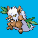

# Elite Four

Theme: attack styles

## Pan
Theme: Defense

Hiya, how's it going?
I'm Pan of the Elite Four!
My Pokémon are super tough and
resilient!
They can take a hit or two before
they destroy you.
Go ahead and show me whatchu got!

(Post-battle-text)

You showed that you are a worthy
opponent. Go ahead!

## Libra
Theme: Balance

I am Libra of the Elite Four.
I believe that a good trainer can
strike a balance between offense
and defense.
Our battle will show you what I mean.

It appears you have already mastered
the art of balance…

(Post-battle talk text)

### Pokémon

Lanturn @ Leftovers

## Ranjeet
Theme: Offense

The bond we share with our Pokémon is
unique to every Trainer.
I'm Ranjeet of the Elite Four, and
I specialize in the offensive battle
style.
You better have kept your Potions and
Revives ready!

(Post-battle-text)

You're almost at the end! Good luck!

### Pokémon

Shiftry @ Life Orb

## Eris
Theme: Stall

Looks like you somehow managed to
get this far.
I'm Eris of the Elite Four, and
I believe that everything is fair
in a Pokémon Battle.
Watch me go all out on this one!

(Post-battle-text)

That was a great battle. But will
you be able to take down the Champ?

### Pokémon
Blissey @ Leftovers
- Minimise
- Thunder Wave
- Seismic Toss
- SoftBoiled

Sableye @ Leftovers

Togekiss @ Shell Bell

Skarmory @ Leftovers

Clefable @ Leftovers
- Attract
- Moonblast
- Toxic
- SoftBoiled

Machamp @ Leftovers
Trait: No Guard
EVs: 252 HP / 252 Atk / 4 Spd
Adamant Nature (+Atk, -SAtk)
- Substitute
- DynamicPunch
- Payback
- Stone Edge
