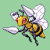
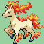
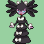
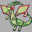
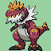
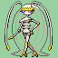

# Gyms

## ?? City Gym

Type: 

Grimer
Level: 9

Gastly
Level: 10

Beedrill
Level: 12

Seviper
Level: 15

## Indya City Gym

Type: 

 

## Perceptown Gym

Type: 

## Westeros City Gym

Type: 

Leader: Daenerys

## Champion

Leader: Hetnai

